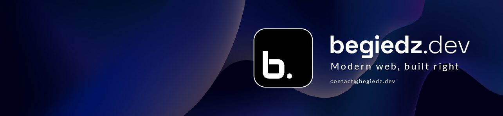

 

```typescript
const success = [];

year.forEach(day => {
  success.push(day.effort);
});
```

`Welcome to Ubuntu 24.04.2 LTS (GNU/Linux 6.11.0-26-generic x86_64)`

`Last login: Sun Jun 15 11:23:45 2025 on tty1`

`begiedz@begiedz-server:~$`

`> Hello there!`

`I’m Dariusz - for me, code is more than just lines – it’s craftsmanship. I see interface design as architecture, and user experience as a key part of every project. Simply put – I make things that work great and look awesome.`

`I focus on writing clean, maintainable code and designing interfaces that feel intuitive. My goal is to build things that function smoothly, are easy to navigate, and enhance the user experience rather than getting in the way. Whether it’s frontend development, backend programming, UI design, or performance optimization, I keep things simple, practical, and effective.`

`Let’s build something great together!`

# Dariusz Begiedza

## 👾 About Me

### Current Focus

- Pursuing a Bachelor of Engineering, Computer Science degree.

- Building a freelance web development brand. @[begiedz.dev](https://begiedz.dev)

### Motivation

- Focused on building skills that bring real value.

- Driven by continuous self-improvement and problem-solving.

- Working towards aligning passion with career and personal fulfillment.

## 🚀 Tech Stack

#### Frontend


#### Backend & Databases


#### Tooling & Build


#### DevOps & Workflow


---

#### *Currently Learning*


## 📊 GitHub Stats

<div>
  


</div>

## ✉️ Contact

- **Email:** [contact@begiedz.dev](mailto:contact@begiedz.dev)
- **LinkedIn:** [Dariusz Begiedza](https://www.linkedin.com/in/dariusz-begiedza/)
- **Portfolio:** [begiedz.dev](https://begiedz.dev)
