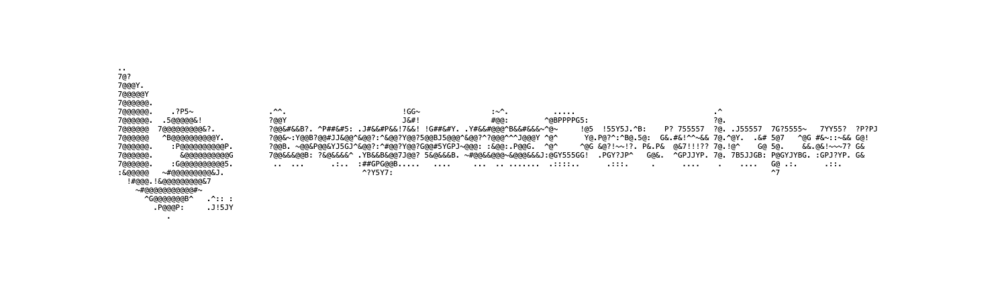

<div align="center">
  
  
</div>

```typescript
const success = [];

year.forEach(day => {
	success.push(day.effort);
});
```

`Last login: Sun Mar  9 09:01:13 on ttys000`

`begiedz@Dariuszs-MacBook-Air ~ %`

`> Hello there!`

`I'm Dariusz, Digital Artisan – a creator who sees code as craftsmanship, interfaces as architecture, and user experience as an essential part of software design. I don’t just write code. I build solutions that are thoughtful, efficient, and user-friendly. My approach is a balance between engineering precision and creative problem-solving.`

`I focus on writing clean, maintainable code and designing interfaces that make sense. My goal is to build things that work well, are easy to navigate, and don’t get in the user’s way. Whether it's front-end development, UI design, or optimizing performance, I keep things simple, practical, and effective.`

`Let's build something together!`

# Dariusz Begiedza

## 👾 About Me

### Passions

- Visual Arts
- Programming
- Software Development

### Motivation

- Focused on building skills that bring real value.
- Driven by continuous self-improvement and problem-solving.
- Working towards aligning passion with career and personal fulfillment.

## 🚀 Tech Stack

### Frontend


### Backend


### Tools & Platforms


## 📊 GitHub Stats

<div>
  
  
</div>

## ✉️ Contact

- **Email:** [begiedz.developer@gmail.com](mailto:begiedz.developer@gmail.com)
- **LinkedIn:** [Dariusz Begiedza](https://www.linkedin.com/in/dariuszbegiedza/)
- **Portfolio:** [begiedzDeveloper](https://begiedz.vercel.app)
